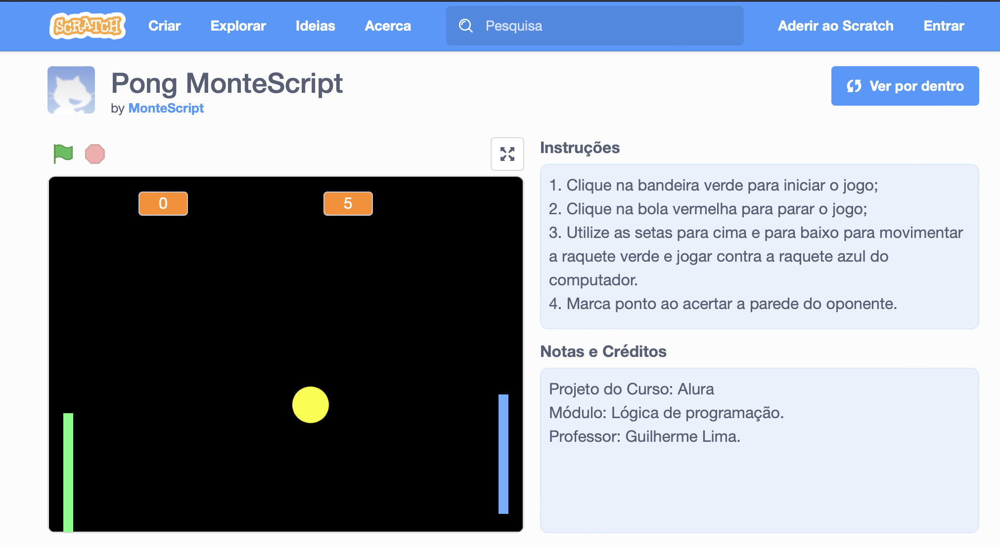

<h1 align="center"> Pong no Scratch </h1>

Programa desenvolvido durante o curso de Lógica de Programação na Alura.  
<a href="https://cursos.alura.com.br/course/pong-javascript/task/56089" target="_blank">Estude esse projeto através desse curso.</a>

  <a href="#-tecnologias">Tecnologias</a>&nbsp;&nbsp;&nbsp;|&nbsp;&nbsp;&nbsp;
  <a href="#-projeto">Projeto</a>&nbsp;&nbsp;&nbsp;|&nbsp;&nbsp;&nbsp;
  <a href="#-jogo">Jogo</a>&nbsp;&nbsp;&nbsp;|&nbsp;&nbsp;&nbsp;
  <a href="#memo-licença">Licença</a>

  

 

  

## 🚀 Tecnologias

Esse projeto foi desenvolvido com as seguintes tecnologias:

- Scratch
- Lógica de programação
- Git e Github

## 💻 Projeto

O jogo pong foi desenvolvido utilizando a linguagem de programação Scratch e simula um jogo de ping-pong com duas raquetes, uma bola e a pontuação de cada jogador.

Na plataforma é possível utilizar várias opções de códigos, fantasias e sons.

Foi implementado a colisão da bolinha com as bordas, minha raquete e a raquete do oponente;

Foi movimentada a raquete do oponente de forma individual, para acertar a bolinha na maioria das vezes;

Foi criado o placar do jogo, indicando os meus pontos e do oponente;

Foi adicionado sons e editado a página do jogo no Scratch para que outras pessoas possam jogar.

[Acesse o projeto finalizado, online.](https://scratch.mit.edu/projects/734114605) 

[Assistir a aula.](https://cursos.alura.com.br/course/pong-javascript/task/56089) 

## 🔖 Jogo

Instruções:

1. Clique na bandeira verde para iniciar o jogo;
2. Clique na bola vermelha para parar o jogo;
3. Utilize as setas para cima e para baixo para movimentar a raquete verde e jogar contra a raquete azul do computador.
4. Marca ponto ao acertar a parede do oponente.

## :memo: Licença

Esse projeto está sob a licença MIT.

---

Feito durante o curso na
<a href="https://cursos.alura.com.br/course/pong-javascript/task/56089" target="_blank">Alura</a>

